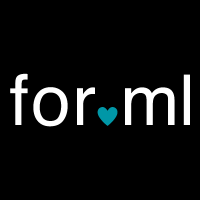

  

  <h1>EmbedPDF</h1>

  <!-- Badges -->

# Open‑Source JavaScript PDF Viewer

**EmbedPDF** is a framework‑agnostic, MIT‑licensed PDF viewer that drops into _any_ JavaScript project. Whether you build with **React, Vue, Svelte, Preact,** or vanilla JS, EmbedPDF delivers a smooth, modern reading experience and a clean developer API.

---

## 📚 Documentation

Full docs, installation guides, API reference, and examples:

👉 **[https://www.embedpdf.com](https://www.embedpdf.com)**

## 🚀 Live Demo

Try it now — load your own PDF or use the sample:

👉 **[https://app.embedpdf.com](https://app.embedpdf.com)**

---

## 💖 Sponsors

We are grateful for the support of our sponsors!

### Bronze Sponsors

  
  &nbsp;&nbsp;

---

## ✨ Features

- Annotations (highlight, sticky notes, free text, ink)
- True redaction (content is actually removed)
- Search, text selection, zoom, rotation
- Smooth, virtualized scrolling
- Pluggable architecture & tree-shakable plugins

## 🤝 Contributing

We love contributions! To get started, read our [contributing guide](CONTRIBUTING.md) and jump into the [GitHub discussions](https://github.com/embedpdf/embed-pdf-viewer/discussions).

## 📄 License

This project is licensed under the MIT License. See the [LICENSE](LICENSE) file for details.

## Third-Party Licenses

This project includes PDFium, licensed under the [Apache License, Version 2.0](packages/pdfium/LICENSE.pdfium).
